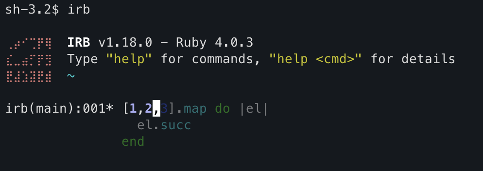

# Irb::Autosuggestions

[](https://rubygems.org/gems/irb-autosuggestions)
[](https://github.com/unurgunite/irb-autosuggestions/actions)



No need to explain. Fish-like autosuggestions for IRB — ghost text from history as you type.

## Contents

* [Irb::Autosuggestions](#irbautosuggestions)
    * [Contents](#contents)
    * [Installation](#installation)
    * [Usage](#usage)
    * [Configuration](#configuration)
        * [Colors](#colors)
        * [How it works](#how-it-works)
    * [Development](#development)
    * [License](#license)

## Installation

Add to your Gemfile:

```ruby
gem 'irb-autosuggestions'
```

`~/.irbrc`:

```ruby
require 'irb-autosuggestions'
```

## Usage

Start typing in IRB. Ghost text appears after the cursor, showing the most recent matching history entry with syntax
coloring (or gray if colorization is unavailable or disabled):

```
irb(main):001* [1,2,3].map do |el|
irb(main):002*   el.succ      <- "cc" in gray
irb(main):003> end            <- "d" in gray
```

Press **right arrow** (`->`) to accept the full multiline suggestion.

## Configuration

Autosuggestions are enabled by default. To disable:

`~/.irbrc`:

```ruby
IRB.conf[:USE_AUTOSUGGESTIONS] = false
```

Or via environment variable:

```sh
export IRB_AUTOSUGGESTIONS=0
```

### Colors

Syntax-colored ghost text is **enabled by default** when `IRB::Color` is available and `IRB.conf[:USE_COLORIZE]` is
true.

To disable colored ghost text (falls back to plain gray):

```ruby
IRB.conf[:USE_COLORIZE] = false
```

Or from command line:

```sh
irb --nocolorize
```

> [!NOTE] Colorized ghost rendering may behave differently across terminal emulators, Ruby versions, and IRB color
> schemes. If you notice visual artifacts (e.g., wrong colors, underlines, or unusual brightness), try disabling the
> feature or switch to the gray fallback or create new issue.

### How it works

- Each keystroke queries `Reline::HISTORY` for the most recent entry whose prefix matches the current buffer.
- The suggestion is rendered inline as ghost text without modifying the buffer.
- When available, the ghost uses `IRB::Color.colorize_code` to match IRB's syntax colors, dimmed via ANSI escape codes
  for visual distinction.
- Extra ghost lines (for multiline history entries) are drawn below the prompt.
- `\e[J` clears stale ghost artifacts from the viewport.
- Right arrow triggers `ed_next_char`, which replaces the buffer with the ghost text.

## Development

```sh
bin/setup
bundle exec rake          # spec + rubocop
```

## License

MIT
